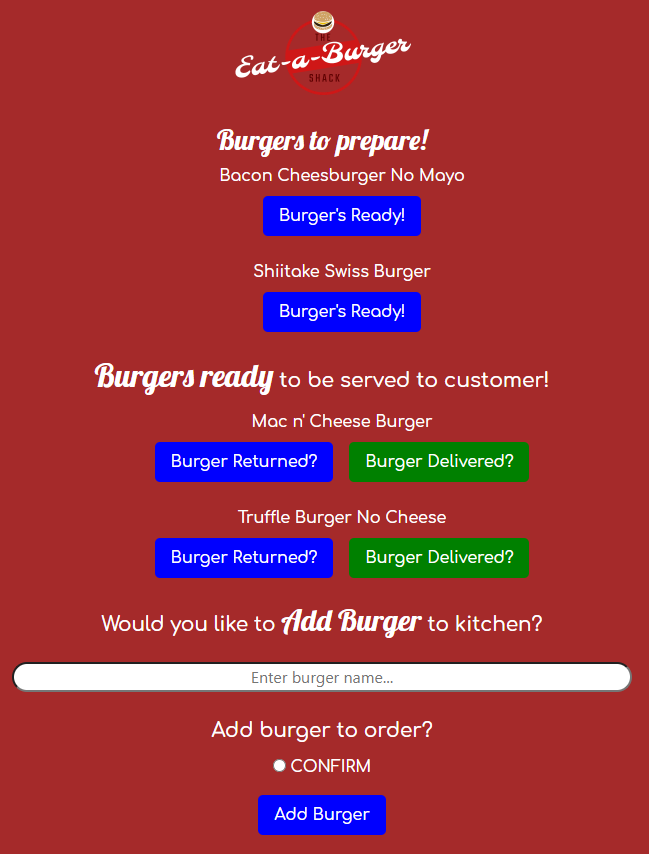

# Eat-A-Burger  

## Description 
 
This application will allow the user to make an order list. It's built in NodeJS with Express. 

## Table of Contents 

* [Usage](#usage-information) 

* [Installation](#installation-instructions) 

* [Where to Contribute](#where-to-contribute) 

* [Repository](#repository) 

* [URL](#url) 

* [Questions](#questions) 

* [Screenshots](#screenshots) 

## Usage Information 
 
Eat a Burger is an application that will allow the user to create burgers that need to be prepared and as they are prepared they'll be moved to the 'Ready to Serve' list and once they're delivered, they'll be removed of the list. 

## Installation Instructions 
 
    npm i 

    
## Where to Contribute 
 
You may contribute to the GitHub below.

## Repository 
 
This repository is hosted in GitHub and you may access it at [https://github.com/johnsbrook/11-Burger](https://github.com/johnsbrook/11-Burger). 

## URL 
 
[Eat-A-Burger](https://eat-a-burger-express.herokuapp.com/)

[YouTube Video](https://youtu.be/nwsfvhQS-rM) 

## Questions 
 
GitHub: [johnsbrook](https://github.com/johnsbrook) 
 
Email: [ivan.zapata-rivera@gmail.com](mailto:ivan.zapata-rivera@gmail.com)

## Screenshot 
 
 
 
